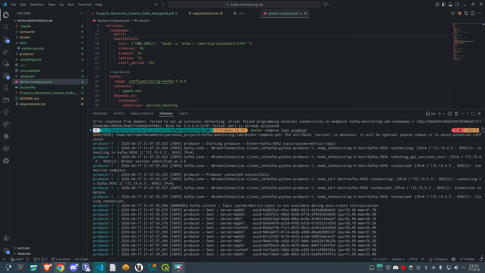
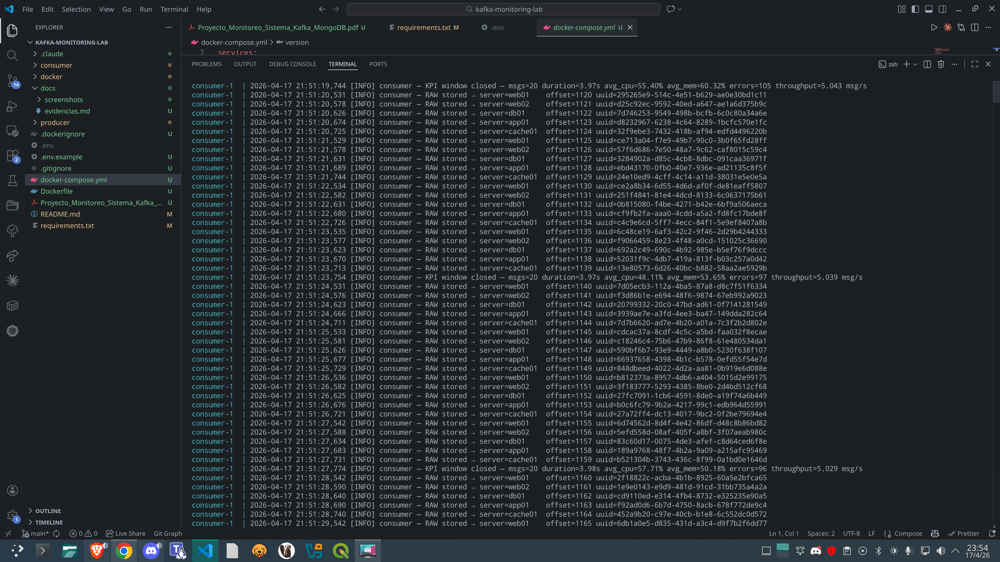
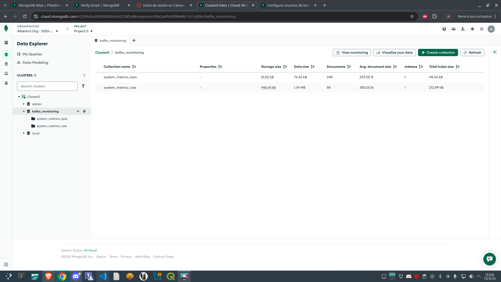
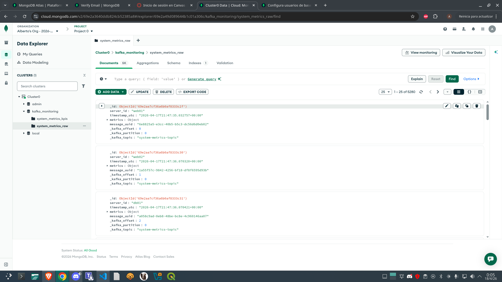
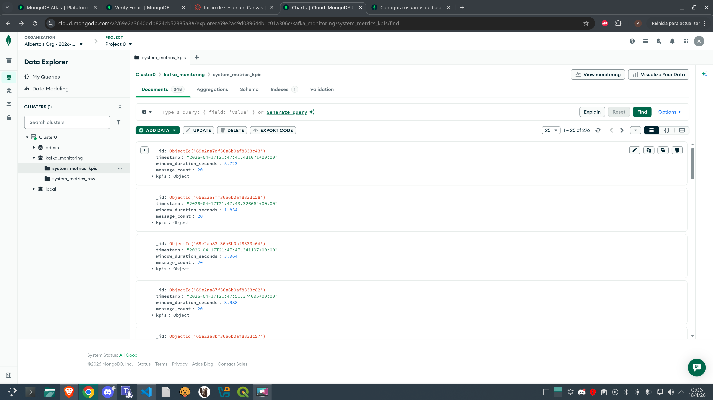

# Evidencias del sistema

## 1. Productor enviando datos

Logs del productor mostrando envío de métricas de los 5 servidores al topic `system-metrics-topic` en Kafka.

## 2. Consumidor procesando mensajes

Logs del consumidor mostrando inserción de documentos en `system_metrics_raw` y cálculo de ventanas de 20 mensajes con KPIs (avg_cpu, avg_mem, errors, throughput) guardados en `system_metrics_kpis`.

## 3. MongoDB — visión general de colecciones

Base de datos `kafka_monitoring` con las dos colecciones creadas automáticamente: `system_metrics_raw`  y `system_metrics_kpis`.

## 4. MongoDB — colección system_metrics_raw

Documentos en bruto almacenados desde Kafka, incluyendo `server_id`, `timestamp_utc`, `metrics`, `message_uuid` y metadatos de Kafka (`_kafka_offset`, `_kafka_partition`, `_kafka_topic`).

## 5. MongoDB — colección system_metrics_kpis

Documentos de KPIs calculados por ventana de 20 mensajes, con `timestamp`, `window_duration_seconds`, `message_count` y el objeto `kpis` con las métricas agregadas.
